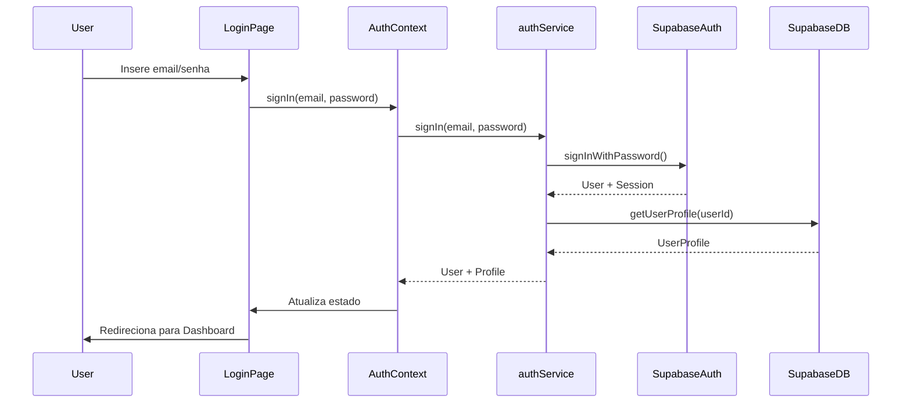
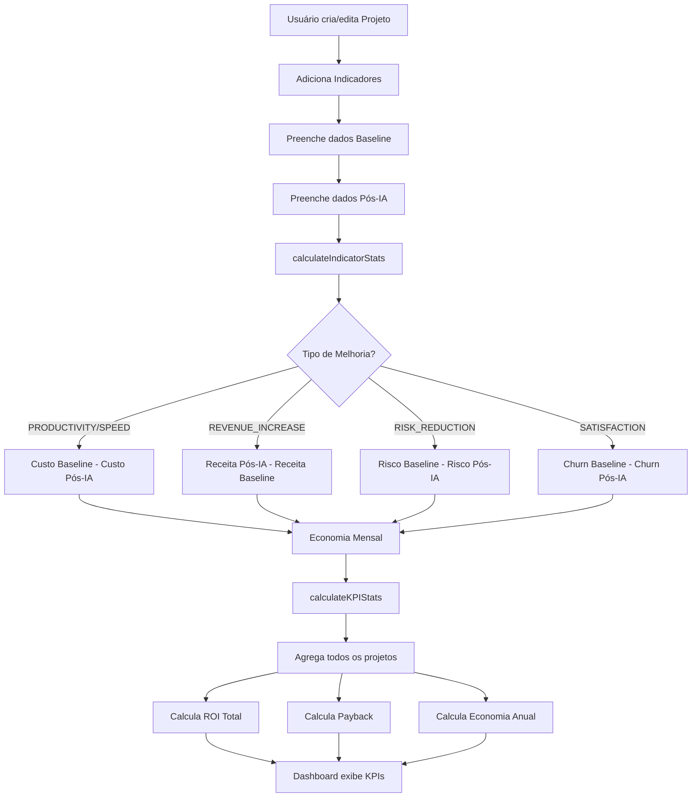
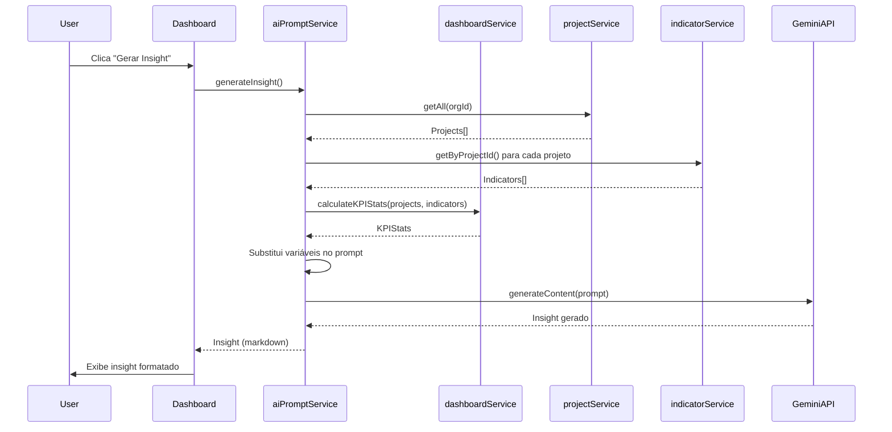

# Architecture Document - ROI Analytics Pro

## Visão Geral

O ROI Analytics Pro é uma plataforma web para mensuração e análise de ROI (Retorno sobre Investimento) de projetos de Inteligência Artificial. A aplicação permite que organizações acompanhem métricas de produtividade, economia e eficiência de suas iniciativas de IA, transformando dados operacionais em insights financeiros.

## Stack Tecnológico

### Frontend
- **React 19.2.4**: Biblioteca JavaScript para construção de interfaces
- **TypeScript 5.8.2**: Superset do JavaScript com tipagem estática
- **Vite 6.2.0**: Build tool e dev server de alta performance
- **React Router DOM 7.13.0**: Roteamento client-side
- **Tailwind CSS**: Framework CSS utility-first
- **Recharts 3.7.0**: Biblioteca de gráficos para React

### Backend & Infraestrutura
- **Supabase**: Backend-as-a-Service (BaaS)
  - PostgreSQL: Banco de dados relacional
  - Supabase Auth: Autenticação e autorização
  - Row Level Security (RLS): Segurança em nível de linha
  - Edge Functions: Funções serverless (Deno runtime)
  - Storage: Armazenamento de arquivos (futuro)

### Integrações Externas
- **Google Gemini API** (`@google/genai 1.38.0`): Geração de insights via IA
- **Resend 4.8.0**: Serviço de envio de emails transacionais

### Ferramentas de Desenvolvimento
- **React Markdown 10.1.0**: Renderização de markdown
- **React Grab 0.0.98**: Ferramenta de desenvolvimento (dev only)

## Arquitetura de Camadas

A aplicação segue uma arquitetura em camadas que separa responsabilidades:

```
┌─────────────────────────────────────────┐
│   Presentation Layer (React Components)  │
│  ┌───────────────────────────────────┐   │
│  │ Pages (Rotas)                    │   │
│  │ - ExecutiveDashboard             │   │
│  │ - ProjectList, ProjectDetail   │   │
│  │ - ProjectCreate                  │   │
│  │ - Reports, Settings              │   │
│  │ - TeamManagement                 │   │
│  └───────────────────────────────────┘   │
│  ┌───────────────────────────────────┐   │
│  │ Components (UI Reutilizáveis)     │   │
│  │ - KPICard, Sidebar               │   │
│  │ - Toast, ConfirmModal            │   │
│  └───────────────────────────────────┘   │
│  ┌───────────────────────────────────┐   │
│  │ Contexts (Estado Global)          │   │
│  │ - AuthContext                    │   │
│  └───────────────────────────────────┘   │
│  ┌───────────────────────────────────┐   │
│  │ Hooks (Lógica Reutilizável)      │   │
│  │ - useToast, useConfirm           │   │
│  └───────────────────────────────────┘   │
└─────────────────────────────────────────┘
                    ↓
┌─────────────────────────────────────────┐
│         Service Layer                   │
│  ┌───────────────────────────────────┐   │
│  │ projectService                    │   │
│  │ - CRUD de projetos                │   │
│  └───────────────────────────────────┘   │
│  ┌───────────────────────────────────┐   │
│  │ indicatorService                  │   │
│  │ - CRUD de indicadores             │   │
│  └───────────────────────────────────┘   │
│  ┌───────────────────────────────────┐   │
│  │ dashboardService                  │   │
│  │ - Cálculos de ROI                 │   │
│  │ - Agregação de métricas           │   │
│  └───────────────────────────────────┘   │
│  ┌───────────────────────────────────┐   │
│  │ authService                       │   │
│  │ - Autenticação                    │   │
│  │ - Gestão de usuários              │   │
│  └───────────────────────────────────┘   │
│  ┌───────────────────────────────────┐   │
│  │ aiPromptService                   │   │
│  │ - Geração de insights via IA      │   │
│  │ - Gestão de prompts               │   │
│  └───────────────────────────────────┘   │
└─────────────────────────────────────────┘
                    ↓
┌─────────────────────────────────────────┐
│          Data Layer                      │
│  ┌───────────────────────────────────┐   │
│  │ Supabase Client                   │   │
│  │ - Conexão com banco               │   │
│  │ - Queries e mutations             │   │
│  │ - Real-time subscriptions         │   │
│  └───────────────────────────────────┘   │
│  ┌───────────────────────────────────┐   │
│  │ Types (TypeScript)                │   │
│  │ - types.ts (fonte de verdade)     │   │
│  │ - Interfaces e Enums              │   │
│  └───────────────────────────────────┘   │
│  ┌───────────────────────────────────┐   │
│  │ Mock Data (Desenvolvimento)       │   │
│  │ - mockData.ts                     │   │
│  └───────────────────────────────────┘   │
└─────────────────────────────────────────┘
```

## Estrutura de Pastas

```
dashboard-roi-v4/
├── pages/                    # Componentes de página (rotas)
│   ├── ExecutiveDashboard.tsx
│   ├── ProjectList.tsx
│   ├── ProjectDetail.tsx
│   ├── ProjectCreate.tsx
│   ├── Reports.tsx
│   ├── Settings.tsx
│   ├── TeamManagement.tsx
│   ├── Login.tsx
│   ├── SignUp.tsx
│   └── ResetPassword.tsx
├── components/               # Componentes reutilizáveis
│   ├── KPICard.tsx
│   ├── Sidebar.tsx
│   ├── Toast.tsx
│   ├── ToastContainer.tsx
│   └── ConfirmModal.tsx
├── services/                # Lógica de negócio e integrações
│   ├── projectService.ts
│   ├── dashboardService.ts
│   ├── authService.ts
│   ├── aiPromptService.ts
│   ├── supabase.ts
│   └── mockData.ts
├── contexts/                # Context API (estado global)
│   └── AuthContext.tsx
├── hooks/                   # Custom hooks
│   ├── useToast.ts
│   └── useConfirm.ts
├── types.ts                 # Definições TypeScript (fonte de verdade)
├── constants.tsx            # Constantes e labels
├── App.tsx                  # Componente raiz e roteamento
├── index.tsx                # Entry point
├── index.html               # HTML template
├── vite.config.ts           # Configuração Vite
├── tsconfig.json            # Configuração TypeScript
├── package.json             # Dependências
├── migrations/              # SQL migrations para Supabase
│   ├── create_ai_prompts_table.sql
│   ├── add_team_management_rls.sql
│   └── ...
└── supabase/
    └── functions/           # Edge Functions (Deno)
        ├── cleanup-indicators/
        └── send-welcome-email/
```

## Fluxo de Dados

### Fluxo de Autenticação



### Fluxo de Cálculo de ROI



### Fluxo de Geração de Insights via IA



## Modelo de Dados

### Entidades Principais

#### Project
Representa um projeto de IA com suas características e custos.

```typescript
interface Project {
  id: string;
  organization_id: string;
  name: string;
  description: string;
  status: ProjectStatus;
  development_type: DevelopmentType;
  start_date: string;
  go_live_date?: string;
  end_date?: string;
  implementation_cost: number;
  monthly_maintenance_cost: number;
  business_area?: string;
  sponsor?: string;
  roi_percentage?: number;
  total_economy_annual?: number;
}
```

#### Indicator
Representa uma métrica de melhoria comparando baseline vs pós-IA.

```typescript
interface Indicator {
  id: string;
  project_id: string;
  name: string;
  description: string;
  improvement_type: ImprovementType;
  baseline: IndicatorData;
  postIA: IndicatorData;
  is_active: boolean;
}
```

#### Organization
Representa uma organização (multi-tenancy).

```typescript
interface Organization {
  id: string;
  name: string;
  created_at: string;
  updated_at: string;
}
```

#### UserProfile
Perfil do usuário com role e organização.

```typescript
interface UserProfile {
  id: string;
  email: string;
  full_name: string | null;
  role: UserRole;
  organization_id: string | null;
  phone: string | null;
  position: string | null;
  department: string | null;
  avatar_url: string | null;
  created_at: string;
  updated_at: string;
}
```

### Relacionamentos

```
Organization (1) ──< (N) Project
Organization (1) ──< (N) UserProfile
Organization (1) ──< (1) AIPrompt
Project (1) ──< (N) Indicator
```

## Segurança

### Row Level Security (RLS)

O Supabase implementa Row Level Security para garantir que usuários só acessem dados de sua organização:

- **Projects**: Usuários só veem projetos da sua organização
- **Indicators**: Acesso através de projetos (herda permissão)
- **UserProfiles**: Admins/Managers veem membros da organização
- **AIPrompts**: Apenas admins podem editar prompts da organização

### Roles e Permissões

- **ADMIN**: Acesso total à organização (criar usuários, editar prompts, gerenciar projetos)
- **MANAGER**: Pode gerenciar projetos e ver membros da equipe
- **ANALYST**: Pode criar e editar projetos e indicadores
- **VIEWER**: Apenas visualização (read-only)

### Autenticação

- Autenticação via Supabase Auth (email/password)
- Tokens JWT gerenciados automaticamente
- Refresh automático de tokens
- Reset de senha via email

## Padrões de Código

### Convenções de Nomenclatura

- **Arquivos de componentes**: PascalCase (`ProjectDetail.tsx`)
- **Arquivos de serviços**: camelCase (`projectService.ts`)
- **Funções**: camelCase (`calculateKPIStats`)
- **Interfaces/Types**: PascalCase (`Project`, `Indicator`)
- **Enums**: PascalCase com valores UPPER_SNAKE_CASE (`ProjectStatus.PRODUCTION`)
- **Constantes**: UPPER_SNAKE_CASE (`DEVELOPMENT_LABELS`)

### Estrutura de Componentes

```typescript
// 1. Imports
import React, { useState, useEffect } from 'react';
import { useParams } from 'react-router-dom';

// 2. Types/Interfaces (se necessário)
interface ComponentProps {
  // ...
}

// 3. Componente principal
const Component: React.FC<ComponentProps> = ({ ... }) => {
  // 4. Hooks de estado
  const [state, setState] = useState();
  
  // 5. Hooks de efeito
  useEffect(() => {
    // ...
  }, []);
  
  // 6. Funções auxiliares
  const handleAction = () => {
    // ...
  };
  
  // 7. Render
  return (
    // JSX
  );
};

export default Component;
```

### Service Layer Pattern

Serviços encapsulam lógica de negócio e comunicação com APIs:

```typescript
export const projectService = {
  async getAll(organizationId?: string): Promise<Project[]> {
    // Lógica de busca
  },
  
  async getById(id: string): Promise<Project | null> {
    // Lógica de busca por ID
  },
  
  async create(project: Omit<Project, 'id'>): Promise<Project> {
    // Lógica de criação
  },
  
  // ...
};
```

## Performance

### Otimizações Implementadas

1. **Code Splitting**: Vite faz split automático de chunks
2. **Lazy Loading**: Componentes carregados sob demanda
3. **Memoization**: Uso de `useMemo` e `useCallback` onde necessário
4. **Virtual Scrolling**: Para listas grandes (futuro)
5. **Image Optimization**: Lazy loading de imagens

### Caching

- **LocalStorage**: Tema, estado da sidebar, multiplicadores de frequência
- **Supabase Cache**: Cache automático de queries
- **React Query**: Pode ser adicionado para cache mais sofisticado (futuro)

## Escalabilidade

### Multi-tenancy

A aplicação suporta múltiplas organizações através de:
- Isolamento por `organization_id` em todas as tabelas
- RLS policies que filtram por organização
- Context de autenticação que gerencia organização do usuário

### Edge Functions

Funções serverless no Supabase para:
- Limpeza automática de indicadores inativos
- Envio de emails transacionais
- Processamento assíncrono (futuro)

## Extensibilidade

### Adicionar Novo Tipo de Melhoria

1. Adicionar enum em `types.ts`:
```typescript
export enum ImprovementType {
  // ... existentes
  NEW_TYPE = 'new_type',
}
```

2. Adicionar cálculo em `dashboardService.ts`:
```typescript
case ImprovementType.NEW_TYPE:
  // Lógica de cálculo
  break;
```

3. Adicionar label em `constants.tsx`:
```typescript
export const IMPROVEMENT_LABELS = {
  // ... existentes
  new_type: 'Novo Tipo',
};
```

### Adicionar Nova Página

1. Criar componente em `pages/`
2. Adicionar rota em `App.tsx`
3. Adicionar link na `Sidebar.tsx` (se necessário)

## Decisões Arquiteturais

### Por que React 19?
- Versão mais recente com melhorias de performance
- Suporte a Server Components (futuro)
- Melhor gerenciamento de estado

### Por que Supabase?
- Backend completo sem necessidade de servidor próprio
- RLS nativo para multi-tenancy
- Auth integrado
- Edge Functions para lógica serverless

### Por que Vite?
- Build extremamente rápido
- HMR (Hot Module Replacement) instantâneo
- Configuração simples
- Suporte nativo a TypeScript

### Por que Tailwind CSS?
- Utility-first acelera desenvolvimento
- Dark mode nativo
- Responsive design fácil
- Bundle size otimizado com purging

## Diagramas Adicionais

Ver diagramas detalhados em:
- `/docs/diagrams/architecture.mmd` - Arquitetura completa
- `/docs/diagrams/data-flow.mmd` - Fluxo de dados detalhado
- `/docs/diagrams/roi-calculation.mmd` - Fluxo de cálculo de ROI
